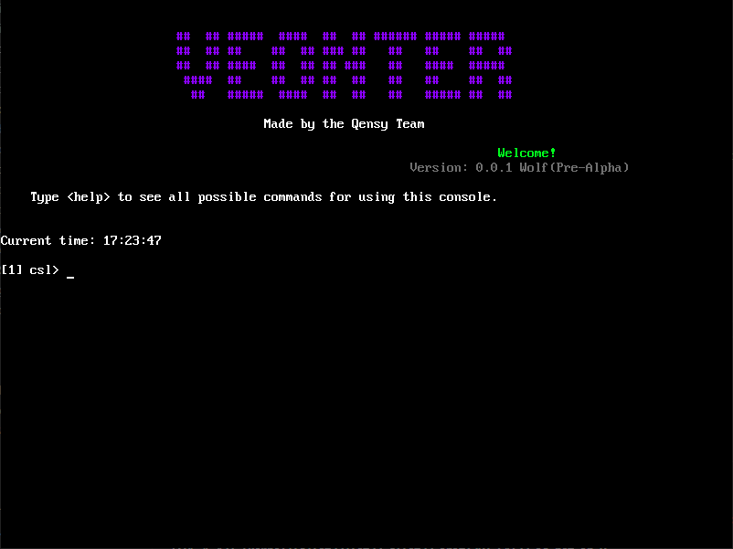
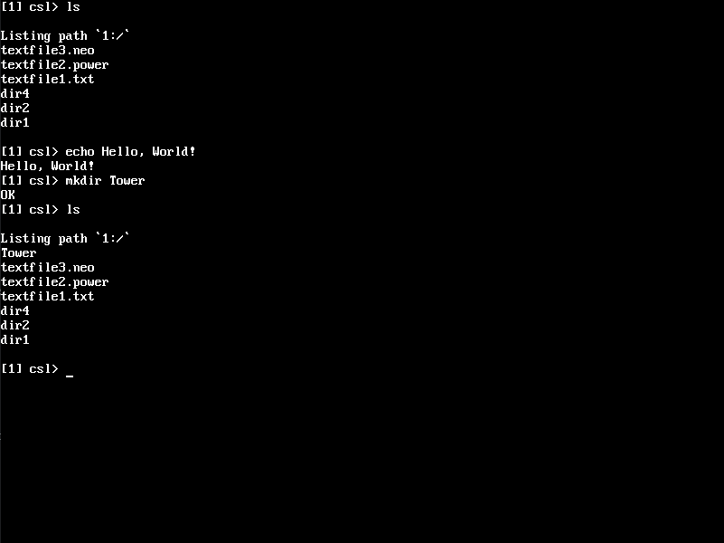

# Veonter Operating System

## Описание
**Veonter** — это 32-разрядная операционная система, находящаяся на стадии ранней разработки (версия 0.0.1 Wolf Pre-Alpha). Основной целью проекта является создание современной и функциональной ОС с поддержкой широкого спектра возможностей и функций. Несмотря на текущую стадию разработки, Veonter уже включает в себя множество ключевых компонентов и функциональных возможностей, таких как:

- Поддержка VBE (VESA BIOS Extensions)
- Управление динамической памятью (Kheap)
- Страничная организация памяти (Paging)
- Обработка ввода с клавиатуры и мыши(PS/2)
- Имеется шрифт
- Консольный интерфейс
- Программируемый интервальный таймер (PIT)
- Программируемый контроллер прерываний (PIC)
- Таблица глобальных дескрипторов (GDT)
- Таблица дескрипторов прерываний (IDT)
- Виртуальная файловая система (VFS) (находится в разработке)
- Обработчики программных прерываний (ISR)
- Обработчики аппаратных прерываний (IRQ)
- Подпрограммы, такие как Калькулятор(calc) и программа для тестов(mm_test)

## Основные возможности
- Консоль с набором команд для взаимодействия с системой
- Возможность отображения графики в графическом режиме

## Скриншоты
Вид после запуска:



Вид во время работы:



## Сборка и запуск
Для сборки необходим компилятор GCC (`i686-elf-gcc`) и система сборки `make`.

Для скачивания исходного кода ОС, используйте Git:

```bash
git clone https://github.com/QensyTeam/Veonter --recursive && cd Veonter
```

Инициализируйте репозиторий:

```bash
bash init.sh
```

И соберите ОС:

```bash
bash build.sh   # Только ядро

# или

bash iso.sh     # Готовый ISO-образ (Образ Veonter.iso будет расположен в корне репозитория)
```

Понадобится виртуальный диск, для его создания выполните следующую команду:

```bash
bash create_disk.sh
```

Если вы хотите протестировать ОС на виртуальной машине вы можете использовать Virtualbox или QEMU.

Пользователи QEMU могут использовать скрипт для запуска:

```bash
bash qemu.sh
```

## Авторы

Разработка Veonter осуществляется **Qensy** и **NDRAEY**, а также при помощи **pimnik98**.
